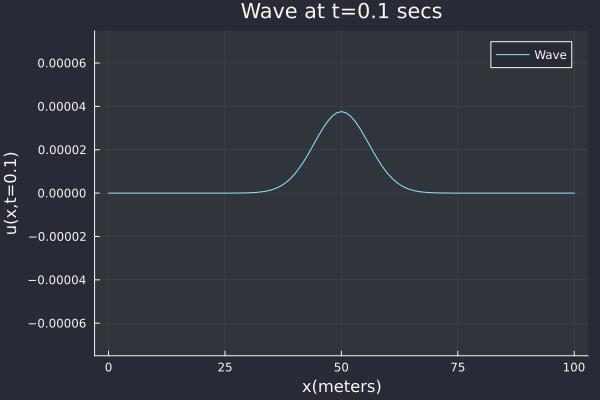

# WaveSim.jl
Earthquakes are one of the most powerful and destructive natural phenomena on Earth. They are caused by the sudden movement or shifting of tectonic plates deep within the Earth's crust, which releases enormous amounts of energy in the form of **seismic waves**. These waves travel through the ground, causing it to shake and tremble violently.

This is my attempt at simulating these waves (accurately) which can be modeled using the Wave Equation

$$\frac{\partial^2 p(x,y,z,t)}{\partial t^2} = c^2(x,y,z) \bigg[\frac{\partial^2 p(x,y,z,t)}{\partial x^2} + \frac{\partial^2 p(x,y,z,t)}{\partial y^2} + \frac{\partial^2 p(x,y,z,t)}{\partial z^2} \bigg] + s(x,y,z,t)$$

## 1D Wave Equation
I will start with the simplest case, i.e. 1D Wave Equation which can be seen as a model for wave on a string (homogenous material)

$$\frac{\partial^2 u(x,t)}{\partial t^2} = c^2 \bigg[\frac{\partial^2 u(x,t)}{\partial x^2} \bigg] + s(x,t)$$

The variable $u(x,t)$ describes the displacement of string (in the vertical direction) at position $x$ and time $t$. 

The constant $c$ defines the speed of wave propagation. In this case, it is dependent on the material property. The higher the value of $c$, the faster will the wave propagate.

Using this as an example, I will explain
- Finite Difference Method for solving PDEs
- Simulation Accuracy: 
    - Numerical Dispersion
    - How the number of points per wavelength affect the accuracy?
    - How much can Higher Order Finite Difference Schemes improve the accuracy?
- Simulation Stability:
    - What exactly is stability (or a stable solution)?
    - Von Neumann Analysis
- Boundary Conditions:
    - Why are they so important? (Hint: they ensure a unique solution!)
    - Understanding different boundary conditions:
        - Dirichlet boundary condition (Zero/fixed/clamped boundary conditions)
        - Neumann boundary conditions (Free boundary conditions)
        - Absorbing boundary conditions

## 2D Wave Equation (NOT FINALIZED YET)
After finishing up the 1D case, I will delve into the 2D simulation, which is modeled using the 2D Wave Equation.

$$\frac{\partial^2 p(x,y,t)}{\partial t^2} = c^2(x,y) \bigg[\frac{\partial^2 p(x,y,t)}{\partial x^2} + \frac{\partial^2 p(x,y,t)}{\partial y^2} \bigg] + s(x,y,t)$$

This is where things get interesting, and I will be discussing
- Finite Difference Method to solve 2D Wave Equation in a Homogeneous medium 
- Simulation Accuracy:
    - Numerical Anisotropy
- Finite Difference Method to solve 2D Wave Equation in a Heterogeneous medium 